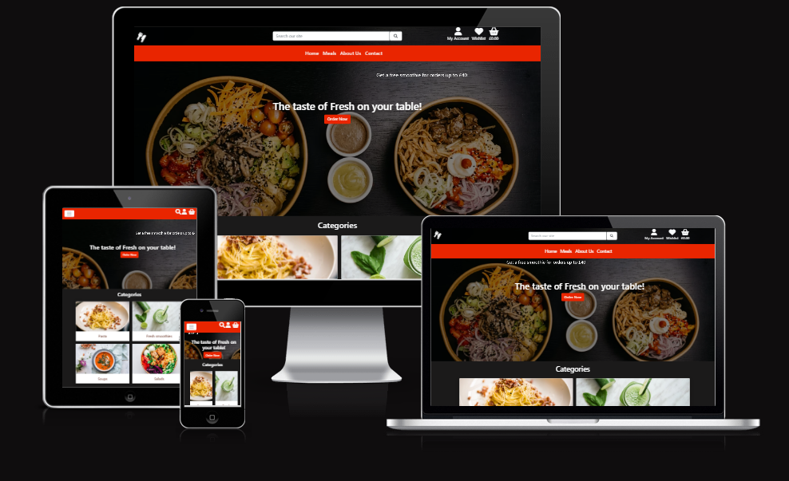
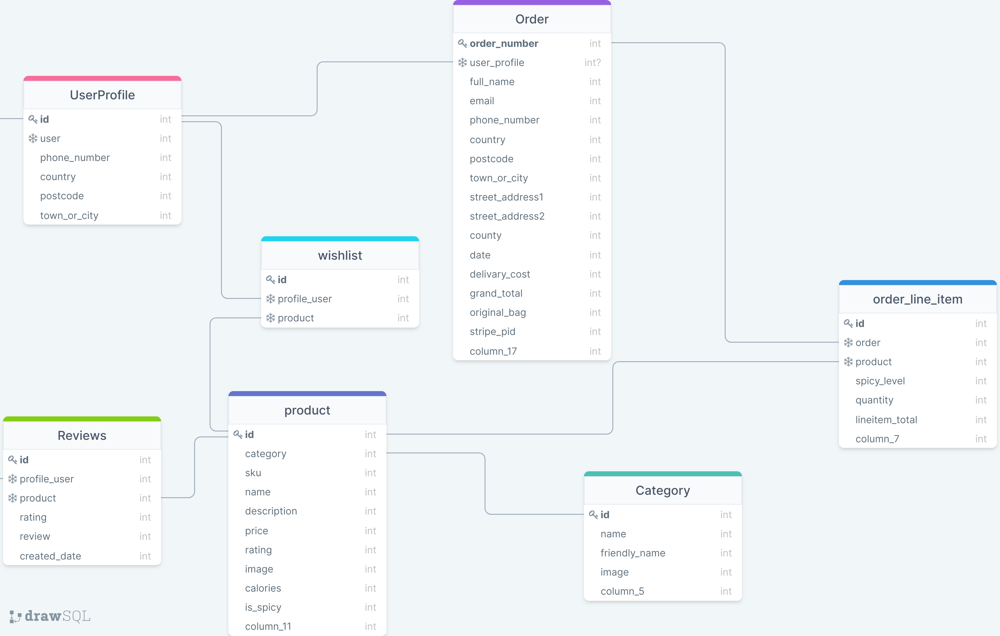

<div align ="center">

# **FreshNow Food Delivery**

</div>

[View the live site here](https://freshnow-store.herokuapp.com/)

<div align ="center">



</div>

## **Introduction**

Welcome to FreshNow store, an e-commerce site was built to fill the requirements of the final project part of my studies on Web Developer Application Diploma. 
This is a fully responsive website, developed by utilising the principles of UX design and using HTML, CSS, Bootstrap, JavaScript, jQuery, Python, Django technologies as well as  SQL database through Heroku PostgreSQL and Stripe online test payments.
FreshNow is a full-stack site based around a business logic used to control a centrally-owned dataset and accepts purchases via Stripe test card details. For further details on cards numbers click [here](https://stripe.com/docs/testing#cards).

## **Contents**

[User Experience (UX)](#user-experience-ux)
* [User Stories](#user-stories)

[Design](#design)
* [Colour Scheme](#colour-scheme)
* [Typography](#typography)
* [Imagery](#imagery)
* [Wireframes](#wireframes)
* [Features](#features)
* [Future Features](#future-features)

* [Information Architecture](#information-architecture)
* [Database Design](#database-design)

* [Technologies Used](#technologies-used)
* [Languages Used](#languages-used)
* [Site Design](#site-design)
* [Hosting](#hosting)
* [Databases Platform and Cloud Storage](#databases-platform-and-cloud-storage)
* [Frameworks and Libraries](#frameworks-and-libraries)
* [Other Technologies](#other-technologies)
* [Testing](#testing)

* [Deployment](#deployment)
* [Requirements for Deployment](#requirements-for-deployment)
* [Initial Deployment](#initial-deployment)
* [How to Fork it](#how-to-fork-it)
* [Making a Local Clone](#making-a-local-clone)

* [Testing and Project Barrier Solutions](#testing-and-project-barrier-solutions)

* [Credits](#credits)
* [Code](#code)
* [Acknowledgements](#acknowledgements)

---
## **User Experience (UX)**

## User Stories

### Regular Site User Stories
* As a site user, I want the main purpose to be clear at first glance so that I can instantly understand if this is the correct site for me.
* As site user, I wish to create an account for future purchases and be able to view my payment history so that I track my payment information. 
* As site user, I wish to login or logout so that I can easily access my profile.
* As site user, I wish to receive a confirmation email after registering my new account, so I can verify that the process was successful.

### Customer Shopper Stories
* As a shopper, I wish to view all the products so that I can choose what I would like to buy.
* As a shopper, I wish to search for a specific product and category so that I find what I want faster.
* As a shopper, I wish to be able to sort the products by price and calories so that I find what I want directly without wasting time on searching. 
* As a shopper, I wish to view products in more detail so I am aware of the full product information.
* As a shopper,  I wish to get visual feedback so  an action has been completed so that avoid making mistakes while adding, editing and deleting products.
* As a shopper, I wish to easily add, update or delete items in my bag where I can view a summary of my orders along with the total price so that I can stick with my budget.
* As a shopper, I wish to easily make a payment so that I smoothly complete the checkout. 

 
### Customers Stories  (Logged in Users) 
* As a logged-in user, I want to be able to view other people's reviews so that I know if the products worth purchasing. 
* As a logged-in user, I want  to be able to add or edit my own reviews to products so that I share my opinion with the other customers.
* As a logged-in user, I want to be able to add products to my wishlist, so that I can view those products later.
* As a logged-in user, I want to be able to delete products from my wishlist, so that I can change my mind.
* As a logged-in user, I want to be able to save my profile details, so that I can avoid retyping my details everytime I place an order.
* As a logged-in user, I want to have order history viewable, so that I can view my past orders.


### Creator Goals
* As a creator, I want the site to be easy to navigate.
* As a creator, I want to allow users to filter through products.
* As a creator, I want to allows admins to Add/Edit/Delete products to/from the store.

## **Design**

### Colour Scheme
* Bright shade of Red (#E92500) was picked as a main color for this site, which creates a sense of urgency and captures attention as well as urges visitors to make quick decisions.Black and white colors picked to balance out the bright attractive red and make the written and pictorial content pop.
  * [Colour Palette - Coolers.co](https://coolors.co/0f5520-fffaea-990b16-6c9c79)
  

### Typography

* The website uses a font from [Google Fonts](https://fonts.google.com/) called 
  _Open Sans_ and is used for all the content, buttons and headings. This font was chosen to be clear and inviting even for customers with poor vision as if they can’t read the menu, they aren’t likely to become regular customers. 

### Imagery

* The icons of the site were taken from font-awesome and used in logo and cards for styling, emphasizing the costumed fields and impoving the site's readability.
* All the images used for the site's products were taken from Unsplash which offers royalty free images. 
* The Home page image which gives a nice and visually appealing background have been taken from Unsplash and aims to show the products in an irresistible manner. 
* The About Us page image was taken from Usplash and aims to give the user intuitive information about the restaurant. 

### Wireframes
Although the project relied on the wireframes below, there are some differences between the them and the final wedsite due to change of mind for different/better UI and functionality. The wireframes show desktop mobile and tablet view size.

* [Home](freshNow_store/documentation/wireframes/home.png)
* [About Us](freshNow_store/documentation/wireframes/about-us-wireframe.png)
* [Sign Up](freshNow_store/documentation/wireframes/register-wireframe.png)
* [Log In](freshNow_store/documentation/wireframes/signin-wireframe.png)
* [My Profile](freshNow_store/documentation/wireframes/profile-wireframe.png)
* [Wishlist](freshNow_store/documentation/wireframes/wishlist-wireframe.png)
* [Products Detail](freshNow_store/documentation/wireframes/product-details-wireframe.png)
* [Shopping Bag](freshNow_store/documentation/wireframes/shopping-bag-wireframe.png)
* [Checkout](freshNow_store/documentation/wireframes/checkout-wireframes.png)
* [Order Success](freshNow_store/documentation/wireframes/checkout-success-wireframe.png)
* [Add Products](freshNow_store/documentation/wireframes/add_product.png)---

## Features

* Home
  * Hero Image
  * List of Categories that lead to the Categorized Products when clicked
  * 

* Navigation Bar
  * 

* Footer
  * 

* About Us
  * 

* View a List of Products
  * Sort the List of Products by:
    * _Calories_ (low - high / high - low)
    * _Price_ (low - high / high - low)
    * 

* Search Bar
  * Sort by meal name:
    * 

* View product Details
  * 
  

* Add Products to Shopping Cart
 * 

* Update quantity and delete Products from Shopping Cart
  * 

* Make purchases of the products in the Shopping Cart
  * If the payment fails, the user is directed back to the checkout form and is shown a message that the payment failed.
  * If the payment succeeds, the user gets a success message and redirects to a page containing all the order details.
  * Ability for a registered user to save their details after making a purchase.
  * 

  * 

* Profile
  * Update Profile
  * User's order history is saved on their profile.
  * 

* Register/Sign In
* Sign Out
* Email Verification
  * 

* Wishlist (for the logged in user)
  * Add or remove items from the Wishlist
  * Display wishlisted items with a red heart on Wishlist page
  * 

  * 

* Diplay of Reviews with Username and the Date it was added, for each Product 
* Submit Reviews (for the logged in user)
* Edit Review
  * 

  * 


* Store owner has the ability to add / edit and delete Products
  * 
  * 


* 404 Page Not Found
* 500 Internal Server Error
  * 

---


### Future Features

- A chat bot where users can ask questions on the site.
- The ability for a registered user to delete their account. 
- The ability for a registered user to delete their reviews. 
- Contact Page
- The ability for the owner to add more meal Categories. 


[Back to Top](#)

## **Information Architecture**

### Navigation bar

The navigation bar changes depending on user status and screen size:

| Nav Link | Logged Out | Logged In (User) | Logged In (Admin) |
|-------|-----|-----|-----|
| Logo (small screen) | &#10060; | &#10060; | &#10060; |
| Logo (large screen) | &#9989; | &#9989; | &#9989; |
| Home | &#9989; | &#9989; | &#9989; |
|Dropdown list of meals categories | &#9989; | &#9989; | &#9989; |
| About Us | &#9989; | &#9989; | &#9989; |
| Search Bar | &#9989; | &#9989; | &#9989; |
| My Account | &#9989; | &#9989; | &#9989; |
| My Account dropdown - Login | &#9989; | &#10060; | &#10060; |
| My Account dropdown - Register | &#9989; | &#10060; | &#10060; |
| My Account dropdown - Profile | &#10060; | &#9989; | &#9989; |
| My Account dropdown - Log Out | &#10060; | &#9989; | &#9989; |
| My Account dropdown - Add Product | &#10060; | &#10060; | &#9989; |
| Wishlist | &#10060; | &#9989; | &#9989; |
| Shopping Basket Icon | &#9989; | &#9989; | &#9989; |

### Database Design
The diagram below illustrates the database structure used in this project.


[Back to Top](#)

---

## **Technologies Used**

### Languages Used

* [HTML5](https://developer.mozilla.org/en-US/docs/Web/Guide/HTML/HTML5)
* [CSS3](https://developer.mozilla.org/en-US/docs/Archive/CSS3#:~:text=CSS3%20is%20the%20latest%20evolution,flexible%20box%20or%20grid%20layouts.)
* [JavaScript](https://developer.mozilla.org/en-US/docs/Web/JavaScript)
* [Python](https://www.python.org/)

### Site Design

* [Font Awesome](https://fontawesome.com/) was used for site's icons.
* [Coolers.co](https://coolors.co/a71313-3c3cdf-0f0f0f-ffffff-198754-ffca02) was used for the colour palette of the site.
* [Google Fonts](https://fonts.google.com/) was used to import the _Open Sans_ and _Dancing Script_ font in the site.


### Hosting
* [GitHub](https://github.com/) stores the code for this project after being pushed from Git.
* [Heroku](https://www.heroku.com) deploys the live site.

### Databases Platform and Cloud Storage
* [SQlite](https://www.sqlite.org/index.html) is the default SQL database engine which is provided by Django and used during development.
* [Heroku Postgres](https://devcenter.heroku.com/articles/heroku-postgresql) is the SQL database service provided by Heroku to store the site's data.
* [Amazon AWS S3](https://s3.console.aws.amazon.com/s3) was used for images hosting and static files.

### Frameworks and Libraries 

* [Django](https://www.djangoproject.com/) was used as a Python web framework.

  - asgiref==3.5.2
  - boto3==1.24.12
  - botocore==1.27.12
  - crispy-bootstrap5==0.6
  - dj-database-url==0.5.0
  - Django==3.2
  - django-allauth==0.51.0
  - django-countries==7.3.2
  - django-crispy-forms==1.14.0
  - django-storages==1.12.3
  - gunicorn==20.1.0
  - jmespath==1.0.1
  - oauthlib==3.2.0
  - Pillow==9.1.1
  - psycopg2-binary==2.9.3
  - PyJWT==2.4.0
  - python3-openid==3.2.0
pytz==2022.1
requests-oauthlib==1.3.1
s3transfer==0.6.0
sqlparse==0.4.2
stripe==3.4.0

* [pip](https://pip.pypa.io/en/stable/) was used to install the required dependencies for this site.
* [Django-countries](https://pypi.org/project/django-countries/) was used for its pre-built country field containing all the valid country codes.
* [Crispy forms](https://django-crispy-forms.readthedocs.io/en/latest/) was used to manage rendering behaviour and layout of Django forms.
* [Gunicorn](https://gunicorn.org/) was used for WSGI HTTP Server to support deployment of Django application.
* [Jinja](https://jinja.palletsprojects.com/en/3.0.x/) was used to auto-populate the site with the contents of the database.
* [Stripe.js](https://stripe.com/docs/js) library was used for handling Stripe payment objects.
* [Bootstrap](https://getbootstrap.com/) was used for the responsive layout of the website.
* [jQuery](https://jquery.com/) was used to make the DOM traversal easier within the JavaScript.

### Other Technologies

* [Git](https://git-scm.com/) was used for version control by utilizing the Gitpod terminal to add and commit to Git and push to GitHub.
* [drawSQL](https://drawsql.app/) was used to design the graph of the relational database.
* [Balsamiq](https://balsamiq.com/) was used to create the wireframes for the initial idea of the project.
* [Am I Responsive Design](http://ami.responsivedesign.is/) was used for the screenshot in this repository's README.md and TESTING.md.
* [Google DevTools](https://developer.chrome.com/docs/devtools/) was used as a general debugger.
* [Lighthouse](https://developers.google.com/web/tools/lighthouse/) was used to check the site's Performance, Accessibility, Best Practices, and SEO.
* [Tinyjpg.com](https://tinyjpg.com/) was used to compress the images.
* [Gitpod](https://gitpod.io/) was used as a virtual IDE workspace to build this site.

### Testing

* [W3C Markup Validation Service](https://validator.w3.org/) tests the HTML validation.
* [W3C CSS Validation Service](http://jigsaw.w3.org/css-validator/) tests the CSS validation.
* [JSHint](https://jshint.com/) tests JavaScript validation.
* [PEP8](http://pep8online.com/) was used to validate the python syntax.


[Back to Top](#la-fraschetta)

---

## **Deployment**

### Requirements for Deployment

* An IDE (such as GitPod or VSCode)
* Git, for version control
* GitHub account
* Python3
* pip, for Python package installation
* Heroku account
* AWS S3 account
* Stripe account
* Email account

#### The are two stages for the deployment of this projects:

### Initial Deployment 

* First step includes Heroku app creation, connection with Postgres database and app deployment without static files.

* Gitpod Local environment
  | KEY         | VALUE |
  | ----------- | ----------- |
  | DEVELOPMENT | True |
    
* Create an env.py file in gitpod

    ```
  import os

  os.environ["SECRET_KEY"] = "#YOUR_SECRET_KEY#"
  os.environ["STRIPE_PUBLIC_KEY"] = "#YOUR_STRIPE_PUBLIC_KEY#"
  os.environ["STRIPE_SECRET_KEY"] = "#YOUR_STRIPE_SECRET_KEY#"
  os.environ["DATABASE_URL"] = "#YOUR_DATABASE_URL#"
  os.environ["STRIPE_WH_SECRET"] = "#YOUR_STRIPE_WH_SECRET#"
  os.environ["AWS_SECRET_ACCESS_KEY"] = "#YOUR_AWS_SECRET_ACCESS_KEY#"
  os.environ["AWS_ACCESS_KEY_ID"] = "#YOUR_AWS_ACCESS_KEY_ID#"
  os.environ["USE_AWS"] = True
  os.environ["EMAIL_HOST_PASS"] = "#YOUR_EMAIL_APP_PASS_CODE#"
  os.environ["EMAIL_HOST_USER"] = "#YOUR_EMAIL_ADDRESS#"

* For the successful deployment of this application on Heroku, the dependencies and running files need to clearly defiend in advance, so Heroku now what is needed to be used. 

  * Creation of requirements file: in the terminal type the following command:
    * `pip3 freeze --local > requirements.txt`
    * This file will hold a list of all dependencies required for this project.
  * Creation of a procfile: in the terminal type the following command:
    * `echo web: python run.py > Procfile` 
    * Make sure there is no blank line after the contents of this file.
* Commit and push these changes to GitHub.
* Login or sign up to [Heroku](https://www.heroku.com).
* Select '**Create New App**' in the top right of your dashboard.
* Choose a unique app name, and select the region closest to you, then click '**Create App**'.
* Go to the '**Deploy**' tab, find '**Deployment Method**', and select '**GitHub**'.
* Find your GitHub repository, and click '**Connect**'.
* Navigate to the '**Settings**' tab and click '**Reveal Config Vars**'.
* Enter key-value pairs that match those in your project files for the keys below:
  | KEY                   | VALUE                   |
  | --------------------- | ----------------------- |
    SECRET_KEY            | YOUR_SECRET_KEY
    STRIPE_PUBLIC_KEY     | YOUR_STRIPE_PUBLIC_KEY
    STRIPE_SECRET_KEY     | YOUR_STRIPE_SECRET_KEY
    DATABASE_URL          | YOUR_DATABASE_URL
    STRIPE_WH_SECRET      | YOUR_STRIPE_WH_SECRET
    AWS_SECRET_ACCESS_KEY | YOUR_AWS_SECRET_ACCESS_KEY
    AWS_ACCESS_KEY_ID     | YOUR_AWS_ACCESS_KEY_ID
    USE_AWS               | YOUR_USE_AWS
    EMAIL_HOST_PASS       | YOUR_EMAIL_HOST_PASS
    EMAIL_HOST_USER       | YOUR_EMAIL_HOST_USER
    DISABLE_COLLECTSTATIC | 1 (Add this variable temporarily)

* Navigate to the '**Resources**' tab in Heorku, and add on '**Heroku Postgres**' with the free plan.
* Current sqlite database back up:
  * This database was initially designed without fixtures, so make sure manage.py file is connected to mysql database.
  * Backup the current database for each of desired model and load it into a db.json file: 
  `python3 manage.py dumpdata your_model_name > db.json`
  * Same action need to repeat for each model you wish to transfer to the postgres database. 
  * Data loading from db.json file into postgres:
  * Creation of temporary variable in the environement named: DATABASE_URL with the value of the Postgres URL from Heroku
  * Packages installation and freeze the requirements:
    * `pip3 install dj_database_url`
    * `pip3 install psycopg2-binary`
    * `pip3 freeze > requirements.txt`
  * In freshNow_Store > settings.py, add `import dj_database_url` at top of the page
  * Connect your manage.py file to your postgres database  
    ```
    DATABASES = {
    'default':  dj_database_url.parse('DATABASE_URL')
    }
    ```
  * Data loading from the db.json file into postgres:
  * `python3 manage.py loaddata <your_file>.json`
  * 
  * Make migrations to start using PostgreSQL:
  * `python3 manage.py makemigrations`
  * `python3 manage.py migrate`
  * Superuser creation to access the Django admin panel: 
  * `python3 manage.py createsuperuser`
  * Username and password addition in the terminal
  * Heroku CLI installation and login:
  * `heroku login` or `heroku login -i`
  * `DISABLE_COLLECTSTATIC = 1` removal from your heroku config vars.
  * Commit and push changes to GitHub.
  * In settings.py file add the hostname of your Heroku app to '**ALLOWED HOSTS**'.
  * Navigate to the '**Deploy**' tab on your Heroku apps Dashboard, and click on '**Enable Automatic Deployment**'.
  * Click open app to view the application in your browser, your app should be displayed without any images and static files.

### 2. Amazon AWS
1. Create an Amazon AWS account

#### S3 Bucket:
2. Search for S3 and create a new bucket
    - Give it a name, choose the region closest to you and allow public access,
3. Under Properties > Static website hosting
    - Enable
    - index.html as index.html
    - save
4. Go to Under Permissions > CORS use the following:
```
[
  {
      "AllowedHeaders": [
          "Authorization"
      ],
      "AllowedMethods": [
          "GET"
      ],
      "AllowedOrigins": [
          "*"
      ],
      "ExposeHeaders": []
  }
]
```

5. Under Permissions > Bucket Policy:
  * _Type of Policy: 'S3 Bucket Policy'_
  * _Principal: '*' to allow all principles_
  * _Action: 'Get Object'_
  * _Amazon Resource Name (ARN): Paste your Bucket ARN and add * at the and of your Bucket Resource key arn:aws:s3:::bucket_name/_ 
  * Click 'Save'
  * Go to the 'Access Control List', Set the list of objects permission for everyone under the 'Public Access' section.

#### IAM
* Click on the 'Services' tab on the top left of the page and search for 'IAM'.
* Go to '**User Groups**', '**Create New Group**', enter a name, and click '**Create**'.
* Go to '**Policies**', '**Create New Policy**', '**JSON**', '**Import Managed Policy**', '**S3**', '**AmazonS3FullAccess**', '**Import**'.
* Get your ARN from '**S3 Permissions**', delete the `*` from '**Resource**', and add the code block underneath this section into the area.
* Click '**Next**', '**Review**', provide a name and description, and click '**Create Policy**'.
* Go to '**User Groups**', '**Find New Group**', '**Permissions**', '**Add Permissions**', '**Attach Policies**', find the policy you created, and click '**Add Permissions**'.
* Go to '**Users**', provide a name, and tick the checkbox beside '**Access key - Programmatic access**'.
* Click '**Next**', select the group you created in step 1, and click through to the end.
* Finally, click '**Create User**', and download the CSV file, which will contain your `AWS_SECRET_ACCESS_KEY` and your `AWS_ACCESS_KEY_ID`. This is the only time that this CSV file will be available, so it's very important to download it at this stage.

```python
"Resource": [
    "{YOUR ARN}",
    "{YOUR ARN}/*"
]
```
#### Final AWS Steps:
* Navigate to S3, you'll see that you have a '**static**' folder with all your static files in it.
* Create a '**media**' file in your S3 Bucket, click '**Upload**'.
* Click '**Add Files**', then add all your product images.
* Under '**Manage Public Permissions**', select '**Grant Public Read Access**'.
* Then click '**Upload**'.
* Finally, attempt to log in to the site using the superuser details, then access the '**admin**' panel on the live site, go to '**Email Addresses**', and select Primary and Verified on the superuser email address.

### How to Fork it

1. Login or Sign Up to [GitHub](www.github.com).
2. On GitHub, go to [KonstantinaStrantzali/FreshNow-food-corner](https://github.com/KonstantinaStrantzali/FreshNow-food-corner).
3. In the top right, click "Fork".

### Making a Local Clone

   1. Log in to the [GitHub Repository](https://github.com/KonstantinaStrantzali/FreshNow-food-corner).
2. Click "Code" above the list of files, where you can Clone or Download the repository.
3. To clone using HTTPS click the clipboard symbol under "Clone with HTTPS".
4. Open Git Bash.
6. Current working directory needs to be changed to the new location, where you want the cloned directory to be.
7. Type `git clone`, and then paste the URL copied in Step 3.
8. Press Enter, to creat the local clone.


[Back to Top](#)

---

## **Testing And Project Barrier Solutions**

All testing and project barriers and solutions has been documented here - [TESTING.md](https://github.com/KonstantinaStrantzali/FreshNow-food-corner/blob/master/TESTING.md)

[Back to Top](#)

---


## **Credits**

### Code

* A large amount of code came from the Code Institute, Boutique Ado Mini Project Walkthrough by Chris Zielinski.
* The core functionality of FreshNow all  taken from the Boutique Ado project. 
* Django Documentation. 
* Stackoverflow for help figuring out django error codes, and searching for bug fixes.
* Python Package Index for customizing a country list django-countries.

### Acknowledgements

A heartfelt thank you to:
* My mentor Ronan for his helpful advices, support and inspiration that helped me deal with hard times and keep my motivation. 
* Code Institute tutors for their assistance. 
* My family, the sweet thought of them keeps me always focused and determined to achieve my goals.
* To Stef for all his jokes, support, comfort and love that helped me overcome the feelings of imposter syndrome.