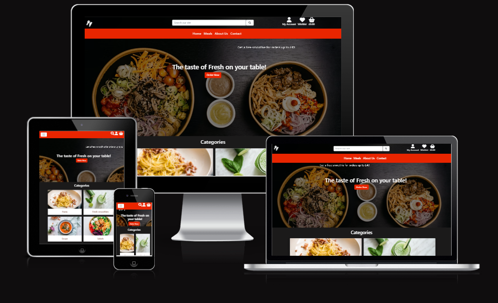

# **FreshNow Food Delivery**

[View the live site here](https://freshnow-store.herokuapp.com/)

## **Introduction**

Welcome to FreshNow store, an e-commerce site was built to fill the requirements of the final project part of my studies on Web Developer Application Diploma. 
This is a fully responsive website, developed by utilising the principles of UX design and using HTML, CSS, Bootstrap, JavaScript, jQuery, Python, Django technologies as well as  SQL database through Heroku PostgreSQL and Stripe online test payments.
FreshNow is a full-stack site based around a business logic used to control a centrally-owned dataset and accepts purchases via Stripe test card details. For further details on cards numbers click [here](https://stripe.com/docs/testing#cards).

## **Contents**

[User Experience (UX)](#user-experience-ux)
* [User Stories](#user-stories)

[Design](#design)
* [Colour Scheme](#colour-scheme)
* [Typography](#typography)
* [Imagery](#imagery)
* [Wireframes](#wireframes)
* [Features](#features)
* [Future Features](#future-features)

[Information Architecture](#information-architecture)
* [Database Design](#database-design)

[Technologies Used](#technologies-used)
* [Languages Used](#languages-used)
* [Site Design](#site-design)
* [Hosting](#hosting)
* [Databases Platform and Cloud Storage](#databases-platform-and-cloud-storage)
* [Frameworks and Libraries](#frameworks-and-libraries)
* [Other Technologies](#other-technologies)
* [Testing](#testing)

[Deployment](#deployment)
* [Requirements for Deployment](#requirements-for-deployment)
* [Initial Deployment](#initial-deployment)
* [How to Fork it](#how-to-fork-it)
* [Making a Local Clone](#making-a-local-clone)

[Testing and Project Barrier Solutions](#testing-and-project-barrier-solutions)

[Credits](#credits)
* [Code](#code)
* [Content](#content)
* [Media](#media)
* [Acknowledgements](#acknowledgements)

---
## **User Experience (UX)**

### Regular Site User Stories
* As a site user, I want the main purpose to be clear at first glance so that I can instantly understand if this is the correct site for me.
* As site user, I wish to create an account for future purchases and be able to view my payment history so that I track my payment information. 
* As site user, I wish to login or logout so that I can easily access my profile.
* As site user, I wish to receive a confirmation email after registering my new account, so I can verify that the process was successful.

### Customer Shopper Stories
* As a shopper, I wish to view all the products so that I can choose what I would like to buy.
* As a shopper, I wish to search for a specific product and category so that I find what I want faster.
* As a shopper, I wish to be able to sort the products by price and calories so that I find what I want directly without wasting time on searching. 
* As a shopper, I wish to view products in more detail so I am aware of the full product information.
* As a shopper,  I wish to get visual feedback so  an action has been completed so that avoid making mistakes while adding, editing and deleting products.
* As a shopper, I wish to easily add, update or delete items in my bag where I can view a summary of my orders along with the total price so that I can stick with my budget.
* As a shopper, I wish to easily make a payment so that I smoothly complete the checkout. 

 
### Customers Stories  (Logged in Users) 
* As a logged-in user, I want to be able to view other people's reviews so that I know if the products worth purchasing. 
* As a logged-in user, I want  to be able to add or edit my own reviews to products so that I share my opinion with the other customers.
* As a logged-in user, I want to be able to add products to my wishlist, so that I can view those products later.
* As a logged-in user, I want to be able to delete products from my wishlist, so that I can change my mind.
* As a logged-in user, I want to be able to save my profile details, so that I can avoid retyping my details everytime I place an order.
* As a logged-in user, I want to have order history viewable, so that I can view my past orders.

### Creator Goals
* As a creator, I want the site to be easy to navigate.
* As a creator, I want to allow users to filter through products.
* As a creator, I want to allows admins to Add/Edit/Delete products to/from the store.